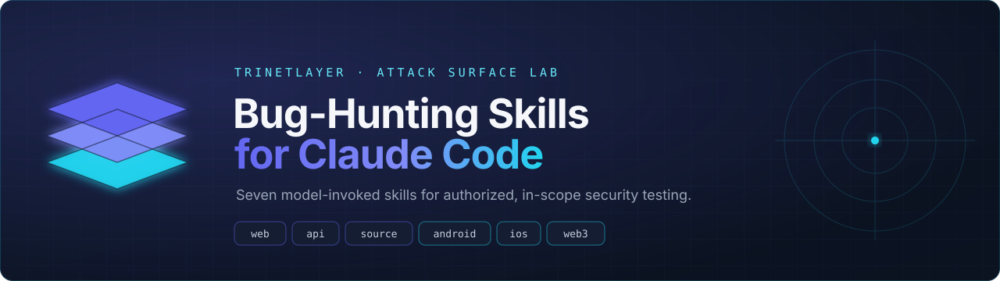
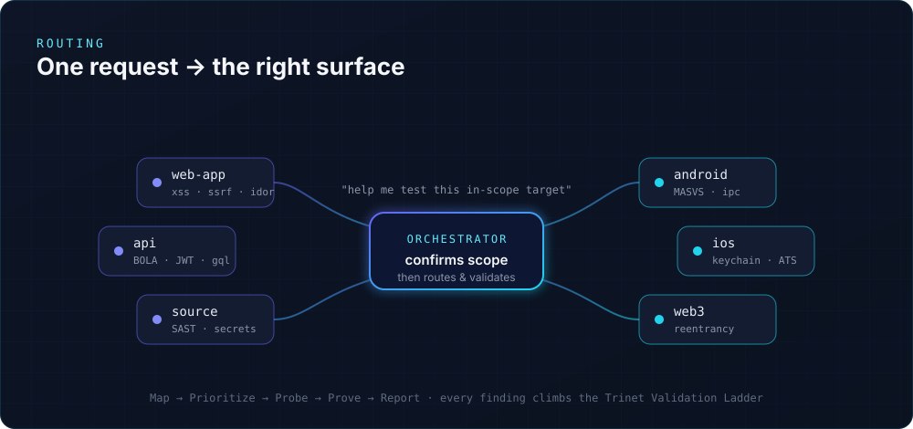
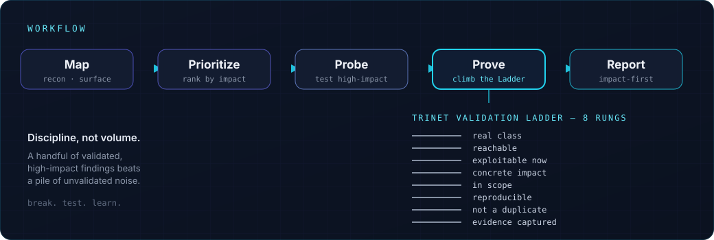
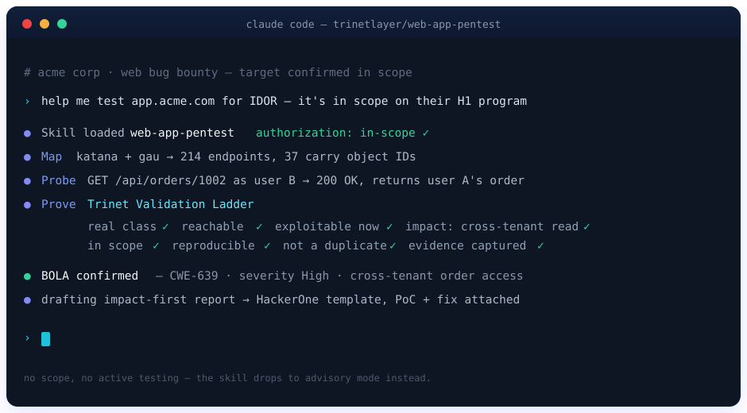

<div align="center">



<br>

[](https://github.com/trinetlayer/claude-HunterSkills/actions/workflows/validate.yml)
[](LICENSE)
[](#the-seven-skills)
[](https://claude.com/claude-code)

[](#authorized-use-only)


### Turn Claude into a disciplined bug-bounty & pentest co-pilot.

Seven model-invoked [Claude Code](https://claude.com/claude-code) skills — web app, API, source-code
review, Android, iOS, and smart contracts, tied together by an orchestrator that keeps every
engagement **authorized, in-scope, and reportable**.

<br>

```bash
git clone https://github.com/trinetlayer/claude-HunterSkills.git && cd claude-HunterSkills && ./install.sh
```

<sub>Built by <a href="https://app.trinetlayer.com"><b>TrinetLayer</b></a> — the Attack Surface Lab for bug bounty hunters · <a href="USAGE.md">Usage guide</a> · <a href="#install">Install</a> · <a href="#the-seven-skills">Skills</a></sub>

</div>

---

## Why this exists

Claude is already a strong security reasoner — but out of the box it improvises. It doesn't know your
program's rules, it re-derives methodology from scratch every session, and it will happily write up a
missing-header "finding" that gets your report closed as informational.

These skills fix that. Each one loads a real practitioner's playbook the moment your task matches it:
the recon commands, the payloads that actually land in 2025, the false-positives to never submit, and
a validation ladder every finding has to climb before it reaches a report. You describe the target;
the right skill brings the discipline.

> **This is a force multiplier for methodical, authorized testing — not an autonomous exploit bot.**
> It won't touch anything out of scope, and with no scope it refuses to test at all.

---

## The seven skills

<div align="center">

</div>

| | Skill | Reach for it when… | Signature classes |
|---|---|---|---|
| 🧭 | **bug-hunting-orchestrator** | You're starting out, or not sure which skill fits | Scope check · routing · methodology |
| 🌐 | **web-app-pentest** | Testing a website, SPA, dashboard or login flow | IDOR/BOLA · XSS · SSRF (IMDSv2) · SQLi · SSTI · auth & logic · chains |
| 🔌 | **api-security-testing** | Testing REST / GraphQL / gRPC | OWASP API Top 10 · BOLA/BFLA · JWT · mass assignment · GraphQL DoS |
| 🔎 | **source-code-review** | Auditing a repo, PR or diff | source→sink SAST · secrets · dependency confusion · CI/CD injection · crypto misuse |
| 🤖 | **android-pentest** | Testing an Android app / APK | MASVS · exported components · insecure storage · Flutter/RN traffic · pinning bypass |
| 🍎 | **ios-pentest** | Testing an iOS app / IPA | Keychain · ATS · URL schemes · WebView bridges · TrollStore · pinning bypass |
| ⛓️ | **smart-contract-audit** | Auditing Solidity / DeFi | reentrancy · oracle manipulation · access control · L2/cross-chain · Foundry PoC |

Roughly **36 vulnerability classes** across Web2, mobile and Web3 — each with how-to-test steps,
payload/command-level detail, and a never-submit list. All seven share one rulebook
([`skills/shared/RULES.md`](skills/shared/RULES.md)).

---

## Authorized use only

⚠️ These skills are for security work you're **allowed** to do: your own assets, in-scope bug-bounty
programs, and signed penetration tests. Every skill opens with an **authorization gate** and enforces
the shared rules — no out-of-scope targets, no DoS, no credential spraying without written approval,
minimal handling of real data.

If you can't show authorization, the skills drop to **passive / advisory mode**: methodology, static
review of code you paste, payload design, and report drafting — no active testing. You are responsible
for staying inside the law and your program's rules.

---

## How it works

Claude Code **Skills** are *model-invoked*: Claude reads each skill's short description and pulls in the
full playbook only when your task matches. You don't memorize commands — you describe the goal, and the
matching skill loads its recon steps, checklists, payloads and reporting format on demand.

<div align="center">

</div>

### See it in action

<div align="center">

</div>

---

## Install

<details open>
<summary><b>Option A — installer script</b> (personal, global — recommended)</summary>

```bash
git clone https://github.com/trinetlayer/claude-HunterSkills.git
cd claude-HunterSkills
./install.sh            # copy into ~/.claude/skills
# or
./install.sh --link     # symlink instead, so `git pull` auto-updates
```
</details>

<details>
<summary><b>Option B — Claude Code plugin marketplace</b></summary>

```
/plugin marketplace add trinetlayer/claude-HunterSkills
/plugin install trinetlayer-bug-hunting@trinetlayer
```
</details>

<details>
<summary><b>Option C — project-scoped</b> (one engagement only)</summary>

```bash
./install.sh --project /path/to/your/engagement   # installs into <project>/.claude/skills
```
</details>

Then start a fresh Claude Code session and just describe the task. To remove everything:
`./install.sh --uninstall`.

---

## Usage in 60 seconds

Lead with your scope — the orchestrator will ask for it if you don't.

```text
"Test app.acme.com for IDOR — it's in scope on their HackerOne program."
"Audit this lending protocol's Solidity for reentrancy and oracle bugs."
"Security-review this pull request for injection and authz gaps."
"Pentest my Android APK — check storage and exported components."
```

| You say… | Skill that loads |
|---|---|
| "Find access-control bugs on this in-scope web app" | web-app-pentest |
| "Test this GraphQL API for BOLA and introspection" | api-security-testing |
| "Audit this IPA's keychain and URL-scheme handling" | ios-pentest |
| "Assess this company — web, API and a repo are in scope" | orchestrator → several |

Full walkthrough, tips, and the two-account trick for access-control bugs → **[USAGE.md](USAGE.md)**.

---

## Under the hood

One rulebook drives all seven skills — [`skills/shared/RULES.md`](skills/shared/RULES.md):

- **Authorization gate** — written scope first, or passive/advisory mode only.
- **Workflow** — *Map → Prioritize → Probe → Prove → Report*, highest-impact classes first.
- **Trinet Validation Ladder** — eight rungs (*real class · reachable · exploitable now · concrete
  impact · in scope · reproducible · not a duplicate · evidence captured*). If a finding can't climb
  all eight, it isn't ready. This is what protects your signal on bounty platforms.
- **Impact-first report format** — with HackerOne / Bugcrowd / Intigriti / Immunefi templates.

---

## TrinetLayer accelerators

Optional — the skills work fully on their own, but they'll lean on TrinetLayer's tooling when it helps:

- **[GhostJS](https://app.trinetlayer.com)** — JavaScript recon + secret scanning (subdomain
  enumeration, source-map/bundle analysis) for the Map phase.
- **Ghost AI** — AI-enhanced analysis of findings.
- **Dependency Confusion** engine — npm dependency-confusion detection during source review & recon.
- **VAPT PDF reports** — export validated findings as a client-ready deliverable.

---

## Ecosystem

Part of the wider TrinetLayer world — *learn → hunt → test → automate → challenge*:

[**App**](https://app.trinetlayer.com) · [**Learn**](https://learn.trinetlayer.com) ·
[**Validator**](https://validator.trinetlayer.com) · [**Blog**](https://trinetlayer.com/blogs) ·
[**Community**](https://trinetlayer.discourse.group)

---

## Contributing

Issues and PRs welcome — new vuln-class coverage, tool/payload updates, platform report templates, and
fixes. Accuracy over volume; keep the responsible-use framing and the shared rulebook intact. See
**[CONTRIBUTING.md](CONTRIBUTING.md)** for the skill format and ground rules,
**[SECURITY.md](SECURITY.md)** for responsible use, and **[CHANGELOG.md](CHANGELOG.md)** for release
history.

## License

[MIT](LICENSE) © 2026 TrinetLayer. Provided for **authorized, lawful** security testing only, with no
warranty. What you point it at is on you.

<div align="center"><sub><code>break. test. learn.</code></sub></div>
